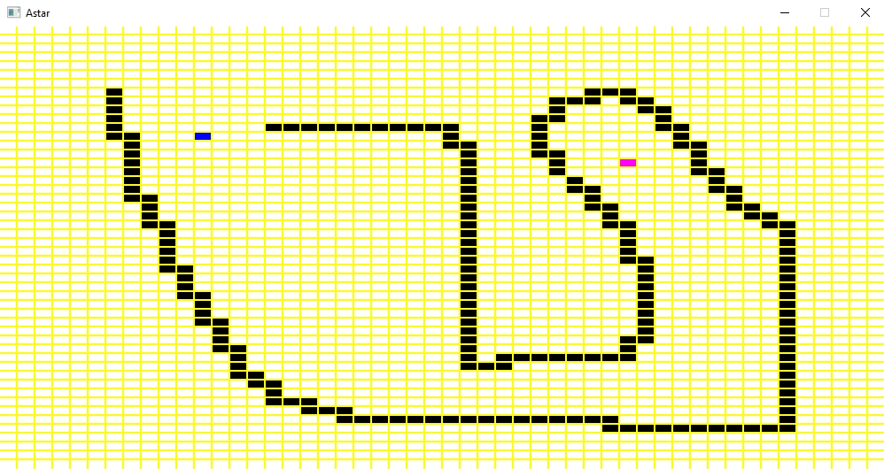

# Astar Algorithm App
> Application used to visualize how A* pathfinding works.

## Table of contents
* [General info](#general-info)
* [Screenshots](#screenshots)
* [Setup](#setup)
* [Technologies](#technologies)
* [Instructions](#instructions)
* [TODO](#todo)

## General info
Aplication allows drawing obstacles for algorithm to overcome in finding the shortest path betwean two points. You can place 
starting and end point wherever you want on application's window. After starting the algorithm you cannot change already placed 
obstacles, starting and end point. Application lets you observe how the algorithm works by visualizing each step that it makes to complete 
the goal.

## Screenshots
>After starting

>Drawing obstacles

>Algorithm work in progress

>Finished algorithm

## Setup
In order to run this programe you will need:
* STML library

## Technologies
* C++20
* STML

## Instructions
After lounching the app you can draw obstacles by clicking left mouse button and dragging mouse across the space you want the obstacles to be placed in. This works similarily to using paint.
In order to place starting point you need to click "S" button on your keybord. Clicking "E" button allows placement of ending point. Clicking any of those buttons turns point placement mode in application 
which is turned off by clicking the button again or placing the point that you intended to. Clicking "C" button clears the screan from any placed blocks. Finaly in order to start the algorithm you need to 
press "Space". The algorithm wont start if starting or end point is not present. During algorithm work you cant draw anything on the screen. If the algorithm finishes you can draw again and pressing "Space" 
will clear previous run and start new one.

## Status
Project is: _curently finished_

